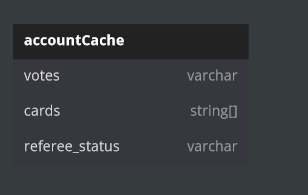
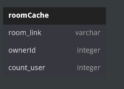
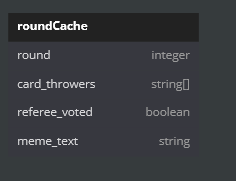

**This is a card game.**

**General Information:**
    Hello, this project is a game that I will launch as a web-based game that I will move to live and at the same time, it is my first project with the GO programming language, I will put something out with my flow diagram above, which I prepared as much as I learned from the interviews I watched, and over time I will share with you why and how I did what I did.

**Game Rules:**
    A room can have a maximum of n players. Customers create a room with a username. Each user can create and join only 1 room. A user must not have an open room to login to a room. 
    A user must not belong to a room to create a room. Once the room is created, a room ID (room ID) is created and users join the room with this ID. Only the person who created the room can invite someone with this room ID. Once the players are connected to the game and all are ready, only the room owner can start the game. Players are dealt 5 cards with meme photos on them. 
    The players try to react to the text on the screen with the cards in their hands. 
    Each player can react to the text in the center within a certain number of seconds in each round with a maximum of 1 card. The funniest of these cards is chosen by the referee in the room. The one with the most votes wins.

 

**Database Information:**

 
    Account Database: 

    accounts -> Table :
            We keep save the data of accounts information.

    account_rooms -> Table:
            We keep save the data of ownership information.
            And we will do authenticate of "Is account joined a room?"!

 
    Game Database:

        rooms -> Table:
            We keep save the data of created room start data in this table.
            And we will do authenticate of "Is there the room and Is account have a room?"!        
      
            
 
    Meme Database:

        
        memeText -> Table: 
            Save data of text of meme.

        memePhoto -> Table: 
            Save data of photo of meme.

 

**Cache Information:**
    We keep live data when player plays the game. 
    
    
    Account Cache:

        The account cache can be accessed with the account:<id> key in redis cli.

        And we can checker like:
            votes -> How much votes player have?
            cards ->  How many cards does the player have?
            referee_status -> is player refere?

 
    Room Cache:

        The room cache can be accessed with the room:<id> key in redis cli.

        And we can checker like:
            room_link -> What is link of room?
            ownerId -> Who is owner the  room?
            count_user -> How much  players are in the room?

 
    Round Cache:

        The round cache can be accessed with the round:<room id> key in redis cli.

        And we can checker like:
            round -> How many rounds are we in?
            card_throwers -> Who are players did played a card?
            referee_voted ->  is referee voted the round?
            meme_text -> What is the text to this round?

 