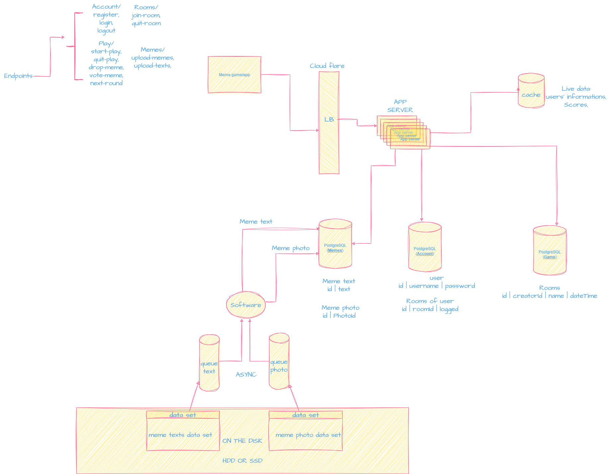
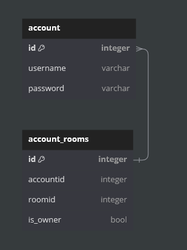
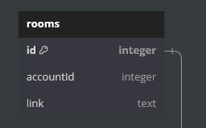
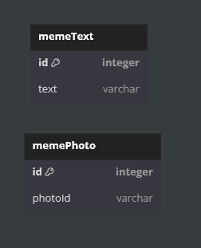

**This is a card game.**

**General Information:**
    Hello, this project is a game that  I will launch as a web-based game that I will move to live and at the same time, it is my first project with the GO programming language, I will put something out with my flow diagram above, which I prepared as much as I learned from the interviews I watched, and over time I will share with you why and how I did what I did.

**Game Rules:**
    There can be a maximum of 10 players in a room.
    Clients create a room with a username.
    Each user can create and join only 1 room.
    A user must not have an open room to log in to a room. 
    A user must not belong to a room to create a room.

    After the room is created, a room ID (room ID) is created and users join the room with this ID.
    Only the person who created the room can invite someone with this room ID. 

    Once the players are connected to the game and all are ready, only the room owner can start the game.
    Players are dealt 5 cards with their meme photos on them.
    Players try to react to the text on the screen with the cards in their hands. 
    Each player can discard 1 card each round.
    And these cards are voted by the players in the room, no one can vote for themselves.
    The one with the most votes wins.

 

**Database Information:**

 
    Account Database: 

    accounts -> Table :
            We keep save the data of accounts information.

    account_rooms -> Table:
            We keep save the data of ownership information.
            And we will do authenticate of "Is account have a room?"!

 
    Game Database:

        rooms -> Table:
            We keep save the data of created room start data in this table.
            And we will do authenticate of "Is there the room?"!
                
      
            
 
    Meme Database:

        
        memeText -> Table: 
            Save data of text of meme.

        memePhoto -> Table: 
            Save data of photo of meme.

